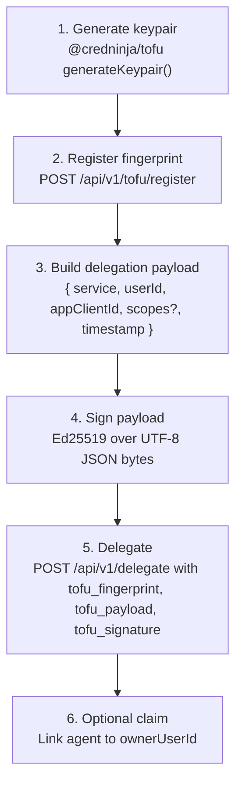

# TOFU Proof of Possession

TOFU (Trust On First Use) gives an agent an Ed25519 identity that it can register with a Cred server once and then reuse for delegation requests. Instead of relying on a pre-shared TOFU-specific token, the agent proves it still controls the registered key by signing a delegation payload inline for each request.

In this repo, the server verifies that proof during `POST /api/v1/delegate`. Registration happens once through `POST /api/v1/tofu/register`, after which the agent can sign delegation payloads and submit the fingerprint, payload, and signature together.

## Flow



Step-by-step:

1. Generate an Ed25519 keypair with `generateKeypair()` from `@credninja/tofu`.
2. Register the public key with `POST /api/v1/tofu/register`.
3. Build a delegation payload containing `service`, `userId`, `appClientId`, optional sorted `scopes`, and a current ISO 8601 timestamp.
4. Sign the UTF-8 bytes of `JSON.stringify(payload)` with the Ed25519 private key.
5. Send the proof to `POST /api/v1/delegate` using `tofu_fingerprint`, `tofu_payload`, and `tofu_signature`.
6. Optionally claim the agent later by assigning an `ownerUserId`.

## Payload Spec

```ts
interface TofuDelegationPayload {
  service: string;      // required; must match POST /api/v1/delegate body
  userId: string;       // required; must match POST /api/v1/delegate body
  appClientId: string;  // required; must match POST /api/v1/delegate body
  scopes?: string[];    // optional; sorted; must exactly match requested scopes if present
  timestamp: string;    // required; ISO 8601 UTC string within +/- 5 minutes of server time
}
```

Field constraints:

- `service` must be the same service slug you send in the request body.
- `userId` must match `user_id` in the request body.
- `appClientId` must match `appClientId` in the request body. Use `"local"` if you do not set one explicitly.
- `scopes`, when present, should be sorted before signing and must match the request scopes exactly.
- `timestamp` must be a current ISO 8601 UTC timestamp. The server rejects stale or future proofs outside the allowed clock window.

## Signing Spec

- Key algorithm: `Ed25519`
- Input: UTF-8 bytes of `JSON.stringify(payload)`
- Output: 64-byte raw Ed25519 signature
- Encoding: standard base64 for both the payload bytes and signature bytes

## SDK Example

```ts
import { Cred } from '@credninja/sdk';
import { generateKeypair } from '@credninja/tofu';

const { publicKey, privateKey, fingerprint } = await generateKeypair();

// One-time registration (no auth required)
await fetch('http://localhost:3456/api/v1/tofu/register', {
  method: 'POST',
  headers: { 'Content-Type': 'application/json' },
  body: JSON.stringify({
    public_key: Buffer.from(publicKey).toString('base64'),
  }),
});

// The current HTTP registration route expects base64 under `public_key`.

const cred = new Cred({
  agentToken: 'cred_at_...',
  baseUrl: 'http://localhost:3456',
});

const result = await cred.tofuDelegate({
  fingerprint,
  privateKeyBytes: privateKey,
  service: 'google',
  userId: 'default',
  scopes: ['gmail.readonly'],
});

console.log(result.accessToken);
```

## Raw HTTP

Registration request:

```http
POST /api/v1/tofu/register HTTP/1.1
Host: localhost:3456
Content-Type: application/json

{
  "public_key": "Base64Encoded32ByteEd25519PublicKey==",
  "initial_scopes": ["gmail.readonly"],
  "metadata": {
    "name": "support-bot"
  }
}
```

Delegation request:

```http
POST /api/v1/delegate HTTP/1.1
Host: localhost:3456
Authorization: Bearer cred_at_...
Content-Type: application/json

{
  "service": "google",
  "user_id": "default",
  "appClientId": "local",
  "scopes": ["gmail.readonly"],
  "tofu_fingerprint": "4c8f7d1a...",
  "tofu_payload": "<base64(JSON.stringify(payload))>",
  "tofu_signature": "<base64(ed25519_signature_bytes)>"
}
```

The decoded `tofu_payload` must be the exact UTF-8 JSON string that was signed.

## Security Notes

- The server enforces a `+/- 5 minute` clock-skew window on `timestamp`. Keep the agent clock synchronized.
- Unclaimed agents are restricted to the bootstrap scopes supplied during registration.
- Claimed agents are governed by the permission model, which defines the maximum scope ceiling for that agent and service.
- Rotate keys with `POST /api/v1/tofu/rotate`. Plan for a grace period so in-flight requests signed by the previous key can still complete safely.
